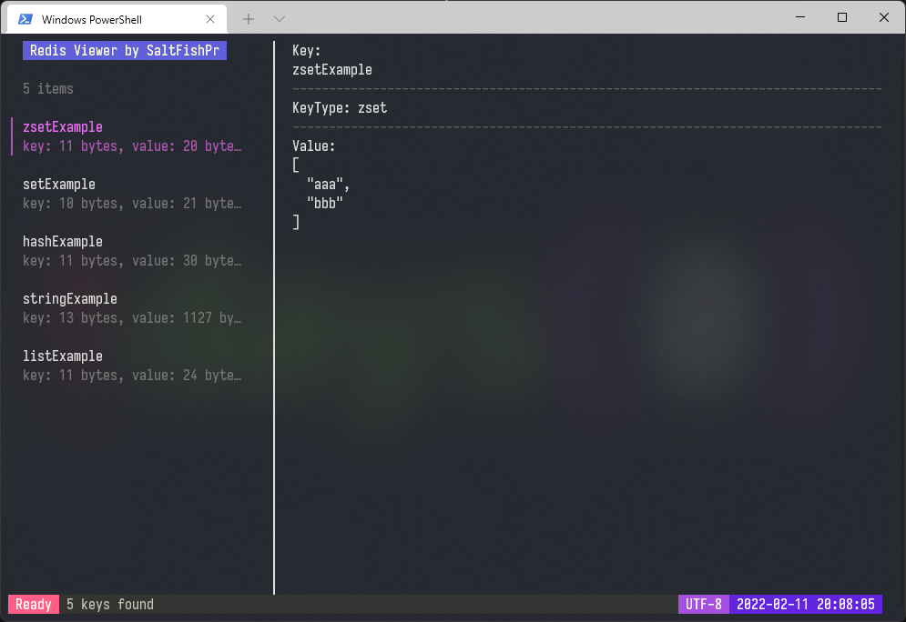

# Redis Viewer

A tool to view Redis data in terminal.



## Install

Go version >=1.16: `go install github.com/SaltFishPr/redis-viewer@latest`

or

Download from [Release](https://github.com/SaltFishPr/redis-viewer/releases).

## Usage:

| KeyBoard | Description            |
| :------: | :--------------------- |
|  ctrl+c  | exit redis viewer      |
|    ↑     | previous key           |
|    ↓     | next key               |
|    ←     | previous page          |
|    →     | next page              |
|    r     | reload data from redis |
|    s     | enter search keywords  |
|  enter   | apply scan with text   |

|    Mouse    | Description        |
| :---------: | :----------------- |
|  scroll up  | detail scroll up   |
| scroll down | detail scroll down |

config file directory:

-   Windows: `%USERPROFILE%/redis-viewer.yml`
-   Linux: `~/.config/redis-viewer/redis-viewer.yml`

example config file:

```yaml
mode: client

addr: 127.0.0.1:6379

master_name:
sentinel_addrs:

password: "123456"
db: 0
```

## Support:

-   client and sentinel connection.
-   `string, hash, list, set, zset` key types.

## Note:

In Windows, you should change system encoding to `UTF-8` before run this program.

## TODOs:

-   [x] Add load animation.
-   [ ] Friendly value detail.
-   [ ] Add log view.

Build with [bubbletea](https://github.com/charmbracelet/bubbletea).
